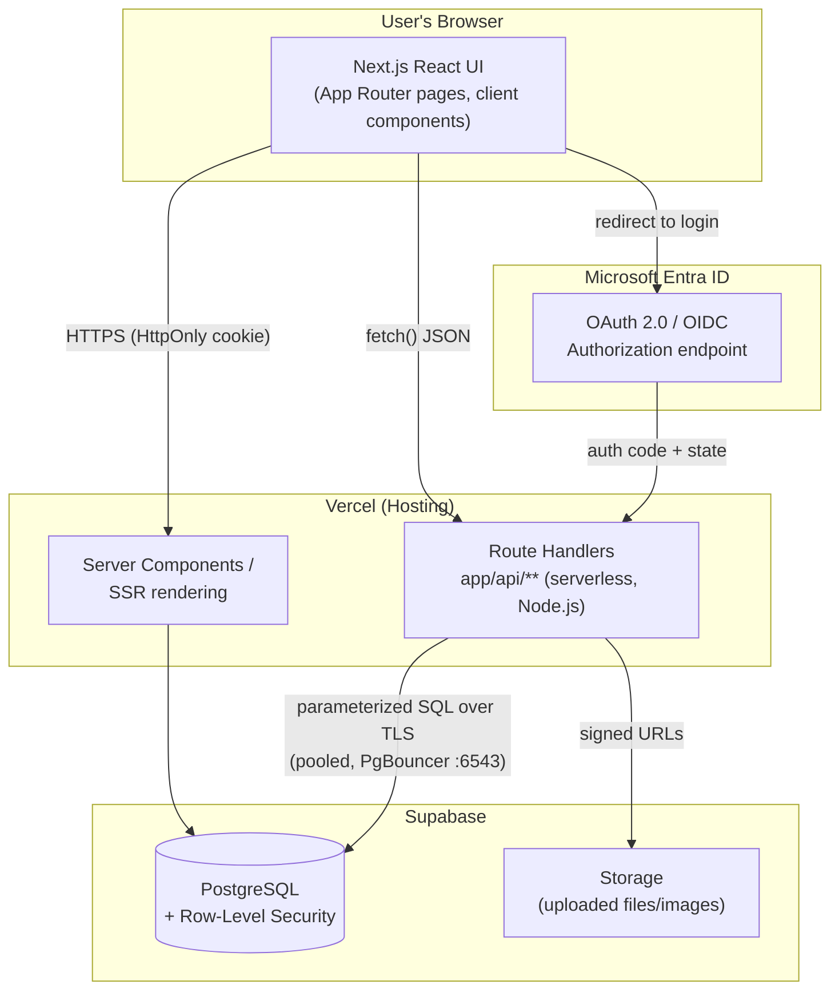
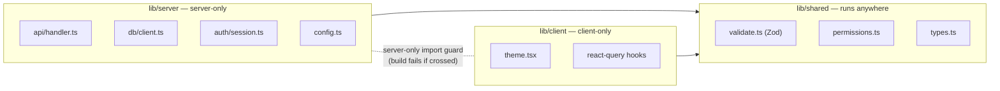
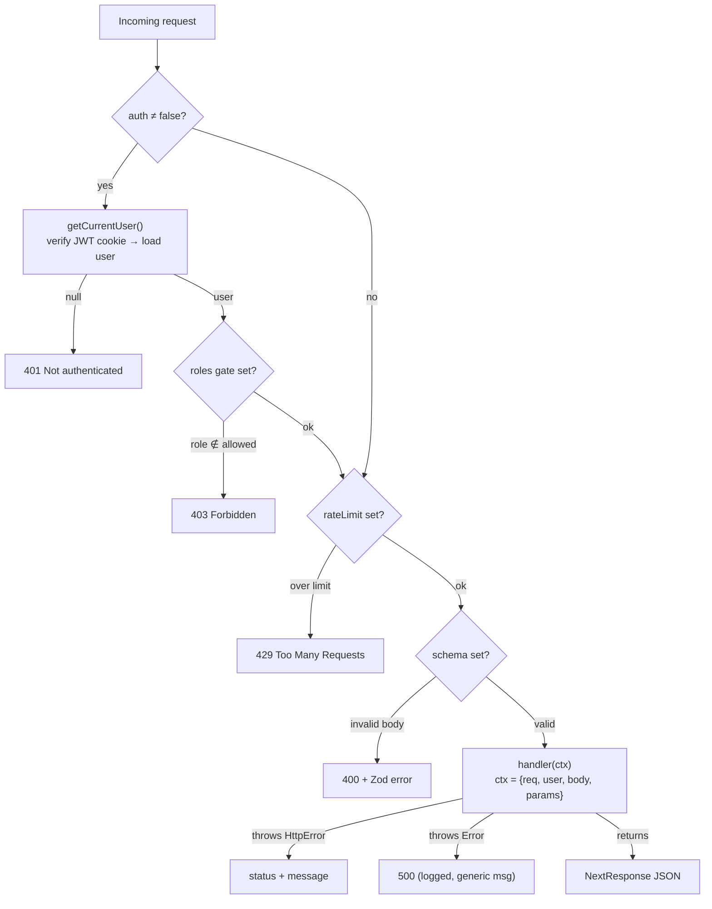
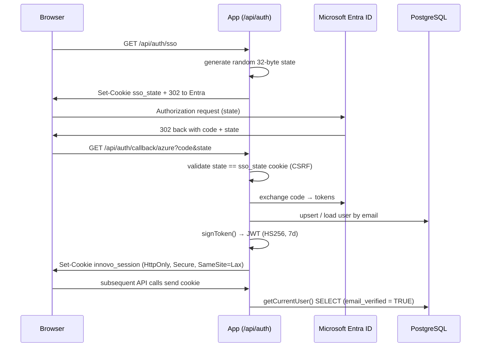
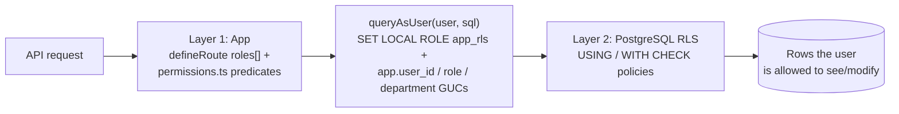
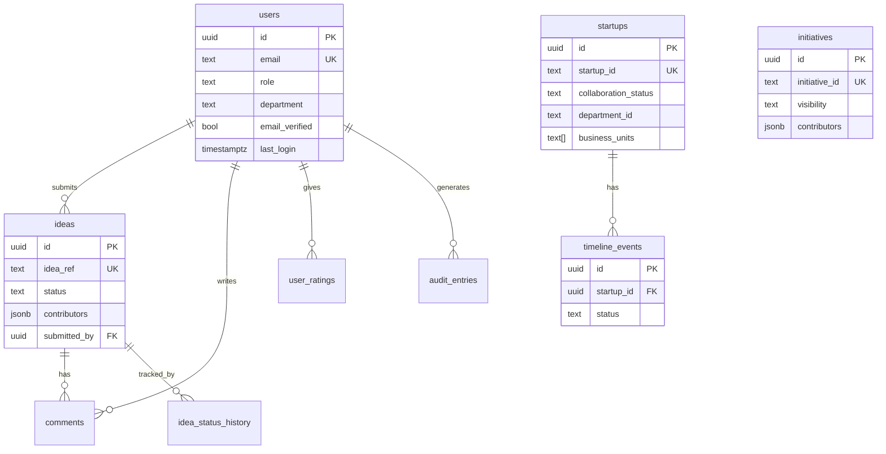
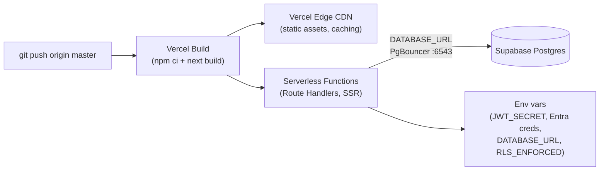
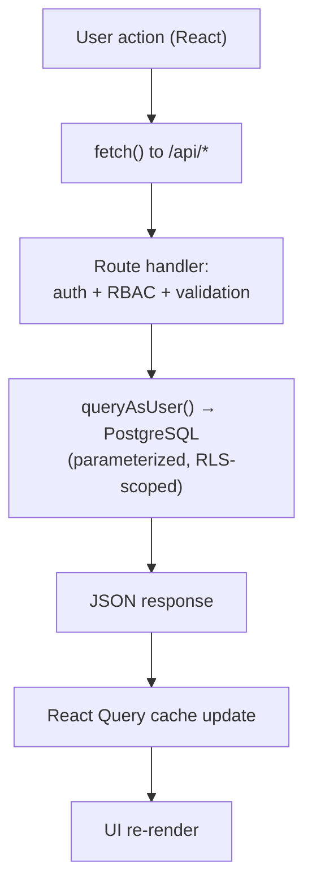

# Innovo Labs Portal — Architecture (HLD + LLD)

**Date:** 4 August 2026 · **Version:** 1.0
**Audience:** Solution architects / reviewing engineers (Payoda) and internal team.

---

## 1. High-Level Design (HLD)

### 1.1 Overview
The Innovo Labs Digital Initiatives Portal is a single **Next.js 16 (App Router)**
application — server and client in one deployable — backed by a **PostgreSQL**
database (Supabase) and authenticated exclusively through **Microsoft Entra ID
(SSO)**. It is hosted on **Vercel** (serverless functions + edge CDN) and deploys
on every push to `master`.

There is **no separate backend service**: the "backend" is the set of Next.js
Route Handlers under `app/api/**`, which run as serverless functions in the
Node.js runtime. This keeps the system small, cheap to operate, and easy to reason
about for the expected scale (single organisation, low thousands of users).

### 1.2 System context

### 1.3 Key architectural decisions

| Decision | Rationale |
|---|---|
| **Monolithic Next.js app** (no microservices) | Scale is one org; a monolith is simpler, cheaper, fewer failure modes |
| **Serverless (Vercel)** | Auto-scales per request, no server ops, pay-per-use |
| **Next.js for API too** | Single deploy, shared TypeScript types front/back, no CORS; API runs in Node.js runtime (not edge) for full `pg` support |
| **PostgreSQL (not NoSQL)** | Data is highly relational (startups ↔ timelines, comments, ratings, ideas); SQL joins are trivial and indexed |
| **JWT in HttpOnly cookie** (stateless) | No server-side session store to run; scales horizontally with zero shared state; HttpOnly blocks token theft via XSS |
| **Entra ID SSO only** | No password storage → no password-breach/brute-force surface; central IT control |
| **Row-Level Security (RLS)** | Authorization enforced in the DB as defense-in-depth, not only in app code |
| **`server-only` / `client-only` guards** | Compiler-enforced isolation so server secrets can never leak into the browser bundle |
| **PgBouncer transaction pooling** | Serverless spawns many short-lived connections; pooling prevents connection exhaustion |

### 1.4 Layered structure (isolation)

- **`lib/shared`** — pure logic usable on both sides (validation schemas, permission
  predicates, TypeScript types). No secrets, no DB.
- **`lib/server`** — marked `import 'server-only'`; holds DB access, auth, config,
  the route handler. A build error is thrown if any of it is pulled into the browser.
- **`lib/client`** — marked `import 'client-only'`; browser-side state/theme/hooks.

---

## 2. Low-Level Design (LLD)

### 2.1 Request pipeline (`defineRoute`)
Every API route is wrapped by a single higher-order function,
`defineRoute(options, handler)` in `lib/server/api/handler.ts`. It removes the
auth / RBAC / validation / rate-limit / error-handling boilerplate from ~28 route
files and puts it in one audited place.

**Options:** `auth`, `roles`, `forbiddenMessage`, `schema` (Zod), `errorMessage`,
`rateLimit`. **Context injected to handler:** `req`, `user` (typed, non-null when
authed), `body` (validated), `params` (awaited dynamic segments).

### 2.2 Authentication & SSO flow

- **Token:** JWT signed with `HS256` (jose), payload `{userId, email, role}`, 7-day
  expiry, stored in the **`innovo_session`** HttpOnly cookie.
- **Session read hot path:** `getCurrentUser()` runs a lean `SELECT` on every
  authenticated request (deliberately excludes the multi-MB `profile_photo`), and
  refreshes `last_login` at most once/hour via `after()` so it never blocks the
  response.
- **Stateless:** logout clears the cookie; there is no server revocation list.
  (Documented trade-off: to force-invalidate all sessions, rotate `JWT_SECRET`.)

### 2.3 Authorization — two layers (defense-in-depth)

- **Layer 1 (app):** role gate in `defineRoute` + fine-grained predicates in
  `lib/shared/permissions.ts` (e.g. `isRecordContributor`, `canViewInitiative`,
  `inStartupScope`).
- **Layer 2 (DB):** when `RLS_ENFORCED=true`, writes/reads on sensitive tables run
  as the restricted `app_rls` role inside a transaction that sets per-request GUCs
  (`app.user_id`, `app.user_role`, `app.user_department`). RLS policies re-check
  the same rules, so a bug or a raw query cannot bypass authorization. System
  writes (audit log, `last_login`, timeline seeding) intentionally stay privileged.

### 2.4 Roles

| Role | Capability summary |
|---|---|
| `super_admin` | Full access; manage users; delete anything; assign contributors |
| `innovation_admin` | Manage content within their department/business-unit scope |
| `contributor` | No access by default; only to ideas/initiatives/startups they are explicitly added to, and only the permitted fields (idea review, initiative Framework tab, startup evaluation) |
| `viewer` | Read-only on what their scope allows |

### 2.5 Data model (core entities)

> Full column-level schema lives in `supabase/migrations/` (51 migrations). Key
> tables: `users`, `ideas`, `initiatives`, `startups`, `challenges`,
> `news_articles`, `collaborations`, `comments`, `user_ratings`,
> `timeline_events`, `idea_status_history`, `audit_entries`.

### 2.6 Deployment topology

### 2.7 Request → UI data flow

### 2.8 Cross-cutting concerns

| Concern | Implementation |
|---|---|
| **Input validation** | Zod schemas (`lib/shared/validate.ts`), enforced in `defineRoute` |
| **Rate limiting** | DB-backed limiter, per-user/IP, applied to mutating routes; fails open if DB down |
| **Caching** | `serverCache` (short TTL) for list endpoints; per-user visibility re-applied on every request even on cache hit |
| **Audit logging** | `audit_entries` table via `logAudit()` on state changes |
| **Error handling** | Central try/catch in `defineRoute`; `HttpError` for typed statuses; generic 500 message to client, full error logged server-side |
| **Secret isolation** | `server-only` import guard; secrets only in `lib/server/config.ts` from env |
| **Security headers** | `X-Frame-Options`, `X-Content-Type-Options`, `Referrer-Policy`, HSTS, `Permissions-Policy` (next.config.js) |
| **SQL injection** | 100% parameterized queries (`$1,$2,…`); no string interpolation of user input |

---

## 3. Non-functional characteristics

| Attribute | Approach |
|---|---|
| **Scalability** | Stateless functions scale horizontally on Vercel; DB pooled via PgBouncer; list endpoints paginated + indexed (47 indexes) |
| **Availability** | Managed platforms (Vercel + Supabase) with their own redundancy |
| **Security** | SSO, HttpOnly JWT, RLS, parameterized SQL, security headers, 0 dependency vulns |
| **Maintainability** | One wrapper for all routes; shared/server/client isolation; conventions in `CONVENTIONS.md` |
| **Observability** | Structured logging (pino); audit trail; Vercel platform metrics *(gap: no APM/alerting yet — see Risk Register)* |
